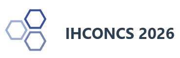

# MuseDSL: Interactive Conference Presentation 🏛️🔬



This repository contains the interactive research-software demonstration and presentation for the paper:  
**"MuseDSL: A Domain-Specific Language and Federated Framework for Explainable Museum Object Linking"**

Prepared for **The International Conference on Computer Sciences (IHCONCS 2026)**, September 17-18, 2026, Zagreb, Croatia (Hybrid).

### 👨‍🔬 Authors
* **Cumali Yaşar**
* **Zafer Karadayı**
* **Ayten Çalık**
* **Emin Ulugergerli**

*Çanakkale Onsekiz Mart University, Türkiye*

---

## 🌟 Features

This is not a static PowerPoint converted to HTML. It is a fully functional React application built to demonstrate the underlying architecture of MuseDSL interactively.

* 🌍 **Bilingual Support**: Instant toggle between English and Turkish (EN/TR) on every slide.
* ⌨️ **Keyboard Navigation**: Use `Arrow Left / Right` or `Space` to navigate, and `L` to toggle the language.
* 🔍 **Interactive Simulations**: Features a live dashboard (Slide 15) to experiment with the `S(q,c)` scoring model, adjusting weights and similarities in real-time.
* 🖥️ **Curator Terminal**: A live simulation (Slide 16) showing a federated semantic query running across autonomous museum agents and visualizing the ACCEPT/REVIEW/REJECT governance states.
* 🔗 **Direct Routing**: Jump to any slide directly via URL hash (e.g., `#16`) or use the built-in dropdown selector.

---

## 🚀 Running Locally

This project is built using **React + TypeScript + Vite**.

### Prerequisites
Make sure you have [Node.js](https://nodejs.org/) installed.

### Installation & Startup

1. Clone the repository:
   ```bash
   git clone https://github.com/cyasar/ihconcs2026musedsl.git
   cd ihconcs2026musedsl
   ```

2. Install dependencies:
   ```bash
   npm install
   ```

3. Start the development server:
   ```bash
   npm run dev
   ```

4. Open your browser and navigate to `http://localhost:5173`.

---

## 🛠️ Building for Production

To create a static production build (for deployment to GitHub Pages or any static host):

```bash
npm run build
```

This will output the compiled assets into the `dist` directory.

### Deploying to GitHub Pages

If you want to deploy this directly to GitHub Pages, you can use the `gh-pages` package:

1. Install `gh-pages` (if not already installed):
   ```bash
   npm install gh-pages --save-dev
   ```
2. Update the `base` path in `vite.config.ts` if your repository name isn't the root domain.
3. Build and deploy:
   ```bash
   npm run build
   npx gh-pages -d dist
   ```

---

## 📄 License & Data Provenance
This project is provided for academic demonstration purposes for IHCONCS 2026.

> **Important Data Provenance Note:**
> Interactive museum records used in the presentation simulation are synthetic illustrative data and must not be interpreted as additional experimental results.
